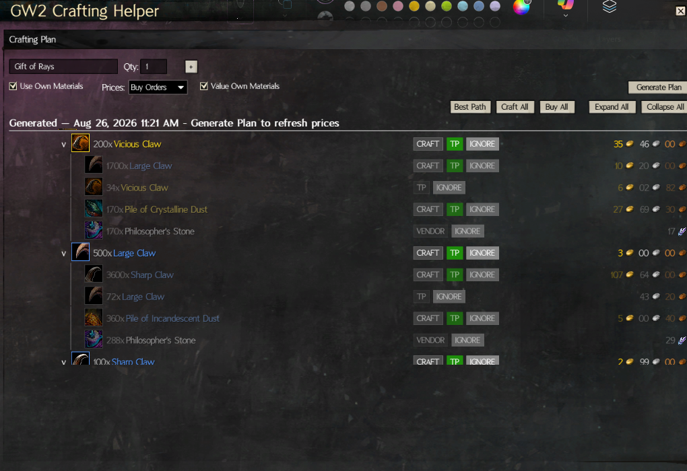
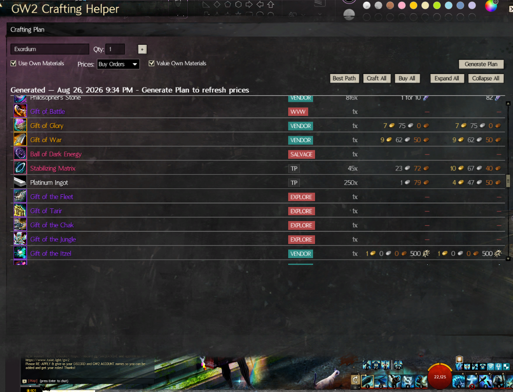

# GW2 Crafting Helper

[](https://github.com/MaximusCub/GW2CraftingHelper/actions/workflows/tests.yml)

A [Blish HUD](https://blishhud.com/) module built around one thing: a crafting-plan
**solver** that answers "what's the cheapest way to get N of this item" for Guild
Wars 2, node by node, the way [gw2efficiency](https://gw2efficiency.com)'s crafting
calculator does. Type in an item, and the module walks its full recipe tree and
decides - for every single ingredient, not just the top-level item - whether to
craft it, buy it off the Trading Post, buy it from a vendor, or use what you
already own, then lets you override any of those decisions by hand and see the
total cost update live.

This is not an inventory viewer with a calculator bolted on. The solver is the
product; the account-data tab exists to feed it (and to let you search/inspect
what you're carrying).

## What it does

- **Per-node buy/craft/vendor decisions.** Every ingredient in the recipe tree is
  independently solved, not just the requested top-level item - a deep Legendary
  precursor tree gets a real decision at every intermediate node.
- **Interactive override pills.** Each node shows its available sources (CRAFT /
  TP / VENDOR / IGNORE) as clickable pills; click one to force a different
  decision and the plan re-solves and re-totals immediately, with tree-wide
  economics (parent costs, currency totals) recomputed correctly. "Best Path",
  "Craft All", and "Buy All" presets are one click away, and Ignore lets you
  drop a subtree from the plan entirely (e.g. "I already have this, stop
  costing it").
- **Owned-materials aware.** Toggle "Use Own Materials" to have the solver treat
  what's already in your bank, shared inventory, material storage, and
  character bags as a competing free source against buying or crafting.
- **Multi-item batches.** Plan several items in one pass; shared ingredients are
  pooled across the batch and vendor purchase batching/rounding is computed
  once for the combined total rather than per item.
- **Sell-side economics.** Where relevant, the plan shows what selling
  intermediate materials would net you (Trading Post sell value net of fees) so
  you can see the real opportunity cost of consuming a material instead of
  selling it.
- **Vendor caps and timegates.** Vendor offers carry weekly/seasonal purchase
  caps and Homestead-refinement/timegate data (scraped from the wiki ahead of
  time - never at runtime); the plan warns when what you're asking for exceeds
  what a vendor will actually sell you in the relevant window.
- **Multiple price bases.** Solve against Buy Orders or Sell Listings, matching
  how you actually intend to acquire the item.

The full normative behavior this module targets is written up in
[`docs/gw2e-parity-spec.md`](docs/gw2e-parity-spec.md) (researched from
gw2efficiency's own open-source calculation libraries at dev time only -
gw2efficiency is never called by the running module). The durable "why" behind
the trickier pieces of the implementation (scroll/relayout handling, the
merged vendor-batch math, and so on) is in
[`docs/ARCHITECTURE.md`](docs/ARCHITECTURE.md).

## Screenshots

Recipe tree with per-node decision pills, Best Path / Craft All / Buy All /
Ignore controls, and the Total Cost breakdown:



Used Materials and Shopping List sections (item names colored by GW2
rarity) with vendor-tagged shopping rows:



## Tabs

- **Snapshot** - your account's items and wallet currencies across bank, shared
  inventory, material storage, and every character's bags, with search and a
  source filter (Bank / Material Storage / Character / etc.).
- **Crafting Plan** - the solver described above: enter an item and quantity,
  generate a plan, and interact with the tree.
- **Log** - the module's own diagnostic log, with a "Copy" button for
  attaching recent log lines to a bug report.
- **Settings** - price basis, owned-materials toggle default, Homestead
  Refinement efficiency tiers, and diagnostic switches.
- **About** - module version, author/contributors, source link, and the
  on-disk data directory (useful for attaching `snapshot.json`/`status.json`
  to a bug report).

("Plan History" and "Crafting Ranker" appear as placeholder tabs reserved for
future work; they have no functional content yet.)

## Installing

There is currently no published Blish HUD Repo listing or GitHub Release for
this module (see [`docs/RELEASING.md`](docs/RELEASING.md) for the full state
of packaging). Until one exists, running it means building from source:

1. Build in Release for `x64`:
   `dotnet build GW2CraftingHelper.csproj -p:Platform=x64 -c Release`.
2. Locate the produced `.bhm` (e.g. `bin\x64\Release\GW2CraftingHelper.bhm`).
3. Copy it into your Blish HUD installation's `modules` directory and
   (re)load Blish HUD.

See [`CONTRIBUTING.md`](CONTRIBUTING.md) for prerequisites and
[`docs/RELEASING.md`](docs/RELEASING.md) for what the `.bhm` packaging step
does and does not currently cover.

### GW2 API key permissions

When Blish HUD prompts you to authorize an API key for this module, it needs:

- **account** - account info and coin balance
- **characters** - character list and inventory access
- **inventories** - bank, shared inventory, and material storage
- **wallet** - wallet currency data
- **unlocks** *(optional)* - lets the plan show which required recipes you've
  already learned

## Building from source / contributing

See [`CONTRIBUTING.md`](CONTRIBUTING.md) for build/test prerequisites, project
structure, and pull request expectations.

```
dotnet build GW2CraftingHelper.csproj -p:Platform=x64
dotnet test tests/GW2CraftingHelper.Tests/GW2CraftingHelper.Tests.csproj
```

## License

[MIT](LICENSE)
